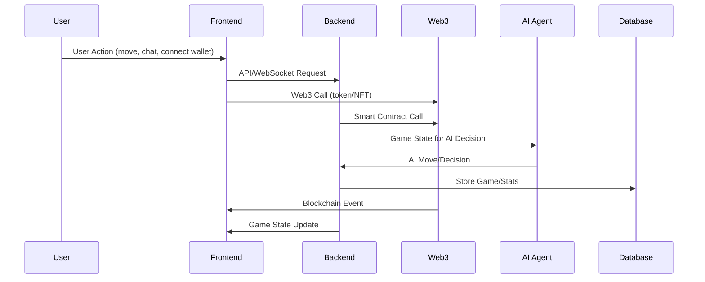

# Architecture Diagram

## System Overview
Ludo Masters is composed of several interconnected subsystems:

- **Frontend**: Built with React, Vite, and TypeScript. Handles UI, user interactions, wallet connections, and communicates with backend and blockchain.
- **Backend/Game Server**: Manages game logic, real-time multiplayer (WebSocket), matchmaking, anti-cheat, and persistent storage.
- **Web3/Blockchain**: Smart contracts (ERC-20, ERC-721/1155) deployed on Polygon/Immutable X. Handles tokens, NFTs, staking, and tournaments.
- **AI Agents**: Pluggable bots with memory/context, supporting various difficulty levels and custom strategies.
- **Database**: Stores user profiles, match history, leaderboards, and analytics.

## Component Breakdown
- **UI Layer**: React components, routing, state management (Zustand), theming.
- **Networking**: REST API for CRUD, WebSocket for real-time game state.
- **Web3 Layer**: Wallet integration (MetaMask, WalletConnect), smart contract calls.
- **AI Layer**: Agent interface, memory/context, decision logic.
- **Persistence**: Database (SQL/NoSQL), off-chain storage for non-blockchain data.

## System Architecture Diagram
```mermaid
graph TD
  User((User))
  Frontend[Frontend (React, Vite, TS)]
  Backend[Backend/Game Server]
  Web3[Web3/Blockchain]
  AI[AI Agents]
  DB[(Database)]

  User -->|UI| Frontend
  Frontend -->|REST/WebSocket| Backend
  Frontend -->|Web3| Web3
  Backend -->|Smart Contract| Web3
  Backend -->|AI API| AI
  Backend -->|DB| DB
  Frontend -->|WebSocket| Backend
  AI -->|Decision| Backend
  Web3 -->|Events| Frontend
```

## Data Flow Diagram


---
Update this file as the architecture evolves.
